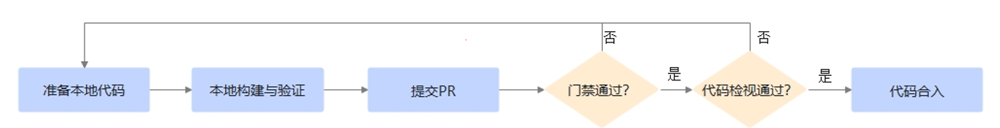

#  PR（Pull Request）操作指南
---

## 1. 🛠️ 准备开发环境

如果您希望参与具体项目贡献（如代码、文档等），首先需要准备 HPCKit 开发环境。请查阅您感兴趣的开源项目中的 `README.md` 文件，了解环境配置的具体要求。

## 2. 📝 了解开发注意事项

### 2.1 项目特定要求

HPCKit 社区不同的项目可能使用不同的编程语言、开发框架和编译环境。请在贡献前，仔细阅读对应项目的 `README.md` 文件，了解具体的编码规范和开发要求。

本章节提供基础规范供社区开发者参考：

| 类别  | 规范及要求 |
| --- | --- | 
| 设计 | [安全设计指南]() |
| 编码 | [C++编程规范]() |
| 编码 | [安全编码规范]()  |
| 编码 | [片段引用指导]() |
| 编译 | [安全编译选项]() |
| 文档 | [文档写作规范]() |

### 2.2 版权声明

在参与项目贡献前，请务必仔细阅读项目根目录下的 `LICENSE` 文件，并确保您的所有贡献符合该许可证的要求。

#### 版权声明要求：

请在所有新建的源代码文件（如 `.cpp`, `.h`, `.py` 等）头部添加规范的版权声明。

#### 声明模板：

请根据项目采用的许可证，选择对应的声明模板：

**对于 木兰宽松许可证, 第2版**
> **注意**： 以下模板中的\<yyyy\>、[name of copyright owner]、[software name]需要更改为首次创建年份、贡献者信息（组织或者个人）、项目名称，

```text
Copyright (c) <yyyy> [name of copyright owner]

[software name] is licensed under Mulan PSL v2.
You can use this software according to the terms and conditions of the Mulan PSL v2.
You may obtain a copy of Mulan PSL v2 at:
       http://license.coscl.org.cn/MulanPSL2
THIS SOFTWARE IS PROVIDED ON AN "AS IS" BASIS, WITHOUT WARRANTIES OF ANY KIND, EITHER EXPRESS OR IMPLIED,
INCLUDING BUT NOT LIMITED TO NON-INFRINGEMENT, MERCHANTABILITY OR FIT FOR A PARTICULAR PURPOSE.
See the Mulan PSL v2 for more details.
```

## 3. 🔄 贡献提交流程



### 3.1 Fork 仓库
- 将目标仓库 Fork 到您的个人账户
- 克隆个人仓库到本地环境
- 在本地分支进行代码、文档等修改

### 3.2 本地验证
- 参考项目说明文档进行本地构建
- 确保代码符合贡献要求

### 3.3 提交 Pull Request
- 代码验证通过后，提交 PR 到目标项目；
- 参照[社区评论命令]()触发门禁测试

### 3.4 代码审查
- **测试未通过**：根据门禁反馈修改代码
- **测试通过**：PR 将分配给 Committer 进行审查，您可以在PR评论区通过`@committer_atomgit_id`提醒 Committer 进行审查，然后及时关注审查意见并进行相应调整。

### 3.5 代码合入
- PR 审查通过后，代码将合入项目主线。

### 📚 扩展资源

- [**AtomGit 工作流详细说明**](atomgit-workflow.md) - 完整的代码贡献流程指南

---
如您在贡献过程中遇到任何问题，欢迎通过社区渠道（ISSUE、邮件等）寻求帮助！
